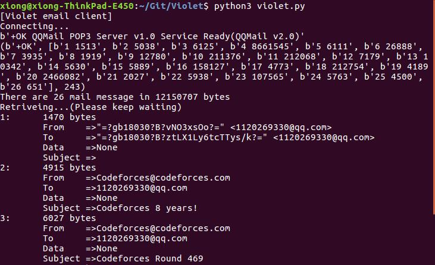
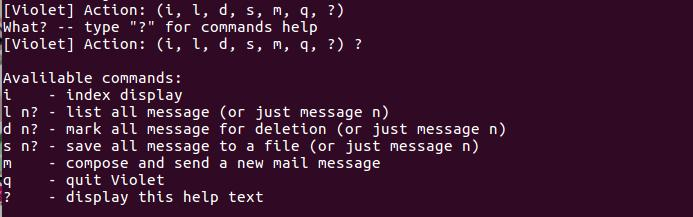

# Violet

I love Violet. And inspired by [wendyltan/Violet-Evergarden][wd/VE], I decide to do this Violet project.

If you are interesting in who is Violet.
You can click here: [Violet Evergarden][wiki-VE].

Reference book:[Programming Python, 4th Edition][O'REILLY]

## Display
- First: Violet will get your mailList and show your mail index.

- Second: You can use `?` to see "helpText".


## Notice
In the Violet, we use [Tencent QQ mail][wiki-QQ].
Both `pop` server and `smpt` server should use `SSL`. And the `smpt` server should login.
If you want to use other e-mail services, the code may need to be modified.

## Installation
- First:  Change `mailInit.ini`.
```
# -*- coding: utf-8 -*-
[DEFAULT]
popServerName=pop.qq.com
popUserName=your-qq-number@qq.com

smtpServerName=smtp.qq.com

sender=your-qq-number
mailPassWd=your_qq_mailbox_apikey

saveMailFile=./mailBox

codingFetch=utf-8
```
- Second:  Run by `$ python3 Violat.py`

## License
See the [LICENSE](./LICENSE) file for license rights and limitations.

[wd/VE]:https://github.com/wendyltan/Violet-Evergarden
[wiki-VE]:https://en.wikipedia.org/wiki/Violet_Evergarden
[O'REILLY]:http://shop.oreilly.com/product/9780596158118.do
[wiki-QQ]:https://en.wikipedia.org/wiki/Tencent_QQ